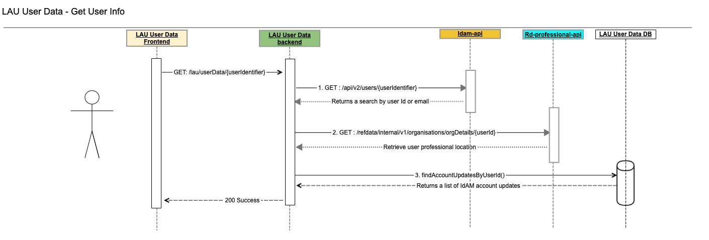

# lau-eud-backend
[](https://opensource.org/licenses/MIT) [](https://sonarcloud.io/summary/new_code?id=uk.gov.hmcts.reform%3Alau-case-backend) [](https://sonarcloud.io/summary/new_code?id=uk.gov.hmcts.reform%3Alau-case-backend) [](https://sonarcloud.io/summary/new_code?id=uk.gov.hmcts.reform%3Alau-case-backend) [](https://sonarcloud.io/summary/new_code?id=uk.gov.hmcts.reform%3Alau-case-backend) [](https://sonarcloud.io/summary/new_code?id=uk.gov.hmcts.reform%3Alau-case-backend)

## Purpose

This is the Log and Audit Enhanced user data Back-End application that will provide an endpoint to capture and retrieve enhanced user data for user.
It aims to provide a comprehensive overview of IdAM users, including detailed timelines of their access profiles and personal details updates.

The API will be invoked by two components - LAU Case front-end which allows CFT Auditors to view enhanced user data for case views and searches and for the source system to store log data into the Log and Audit system.

## Overview

<p align="center">
<a href="https://github.com/hmcts/lau-frontend">lau-frontend</a> • <b><a href="https://github.com/hmcts/lau-case-backend">lau-case-backend</a></b> • <a href="https://github.com/hmcts/lau-idam-backend">lau-idam-backend</a> • <a href="https://github.com/hmcts/lau-eud
-backend">lau-eud-backend</a> •<a href="https://github.com/hmcts/lau-shared-infrastructure">lau-shared-infrastructure</a>
</p>

<br>




## What's inside

The application exposes health endpoint (http://localhost:4553/health).

## Plugins

The application uses the following plugins:

* checkstyle https://docs.gradle.org/current/userguide/checkstyle_plugin.html
* pmd https://docs.gradle.org/current/userguide/pmd_plugin.html
* jacoco https://docs.gradle.org/current/userguide/jacoco_plugin.html
* io.spring.dependency-management https://github.com/spring-gradle-plugins/dependency-management-plugin
* org.springframework.boot http://projects.spring.io/spring-boot/
* org.owasp.dependencycheck https://jeremylong.github.io/DependencyCheck/dependency-check-gradle/index.html
* com.github.ben-manes.versions https://github.com/ben-manes/gradle-versions-plugin

## Building and deploying the application

### Building the application

The project uses [Gradle](https://gradle.org) as a build tool. It already contains
`./gradlew` wrapper script, so there's no need to install gradle.

To build the project execute the following command:

```bash
  ./gradlew build
```

### Running the application

Create the image of the application by executing the following command:

```bash
  ./gradlew assemble
```

Note: Docker Compose V2 is highly recommended for building and running the application.
In the Compose V2 old `docker-compose` command is replaced with `docker compose`.

Create docker image:

```bash
  docker compose build
```

Run the distribution (created in `build/install/lau-eud-backend` directory)
by executing the following command:

```bash
  docker compose up
```

This will start the API container exposing the application's port
(set to `4553` in this template app).

In order to test if the application is up, you can call its health endpoint:

```bash
  curl http://localhost:4553/health
```

You should get a response similar to this:

```
  {"status":"UP","diskSpace":{"status":"UP","total":249644974080,"free":137188298752,"threshold":10485760}}
```

### Alternative script to run application

To skip all the setting up and building, just execute the following command:

```bash
./bin/run-in-docker.sh
```

For more information:

```bash
./bin/run-in-docker.sh -h
```

Script includes bare minimum environment variables necessary to start api instance. Whenever any variable is changed or any other script regarding docker image/container build, the suggested way to ensure all is cleaned up properly is by this command:

```bash
docker compose rm
```

It clears stopped containers correctly. Might consider removing clutter of images too, especially the ones fiddled with:

```bash
docker images

docker image rm <image-id>
```

There is no need to remove postgres and java or similar core images.

## License

This project is licensed under the MIT License - see the [LICENSE](LICENSE) file for details

